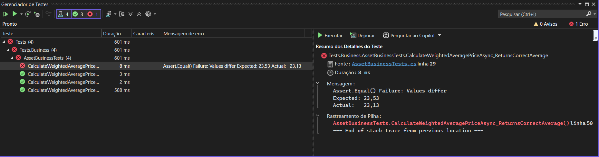

## Testes Mutantes

Testes mutantes é uma técnica de verificação da qualidade dos testes unitários. Essa técnica consiste em introduzir pequenas alterações no código-fonte original (**mutações**) com o objetivo de simular possíveis erros que um desenvolvedor poderia cometer. O principal objetivo é avaliar a **efetividade da suíte de testes** em identificar essas falhas artificiais.

O *mutation testing* parte do princípio de que **bons testes devem falhar quando o código está incorreto**. Quando um teste passa mesmo após uma mutação ser aplicada, isso indica que a suíte de testes **não é sensível o suficiente para detectar mudanças comportamentais relevantes** — ou seja, há um ponto cego que poderia permitir um bug real passar despercebido em produção.

O resultado da aplicação de testes mutantes é chamado de **taxa de sobrevivência**:

- Se o teste detecta o erro (mutação): o mutante é **morto**.
- Se o teste não detecta a mutação: o mutante **sobrevive**, indicando um potencial problema de cobertura lógica.

Uma **baixa taxa de sobrevivência** indica uma suíte de testes bem projetada, enquanto uma alta taxa sugere testes frágeis ou incompletos.

---

### Aplicação prática no método `CalculateWeightedAveragePriceAsync`

Vamos aplicar um exemplo de mutação no método fornecido:

### Código original:

```csharp
totalCost += (trade.UnitPrice * trade.Quantity) + trade.Fee;

```

### Mutação aplicada:

Alteramos o operador `+` por `-`, simulando um erro humano comum (erro de operador matemático):

```csharp
totalCost += (trade.UnitPrice * trade.Quantity) - trade.Fee;

```

Essa mutação muda completamente o cálculo do custo total do ativo, já que em vez de somar a taxa da corretagem (`Fee`) ao custo, ela está sendo subtraída. Em um cenário real, isso representaria uma subavaliação do custo da operação, levando a um **preço médio incorreto** e impactando diretamente os relatórios de P&L (*Profit and Loss*).

### Impacto nos testes:

O teste abaixo deverá **falhar** após essa mutação, indicando que ele está sensível à lógica interna do método:

```csharp
[Fact]
public async Task CalculateWeightedAveragePriceAsync_ReturnsCorrectAverage()
{
    var userId = Guid.NewGuid();
    var assetId = Guid.NewGuid();

    var trades = new List<Trade>
    {
        new Trade { Quantity = 10, UnitPrice = 20, Fee = 1 },
        new Trade { Quantity = 5, UnitPrice = 30, Fee = 2 },
    };

    _tradeRepositoryMock
        .Setup(repo => repo.GetBuyTradesByAssetAsync(userId, assetId))
        .ReturnsAsync(trades);

    var result = await _assetBusiness.CalculateWeightedAveragePriceAsync(userId, assetId);

    Assert.Equal(23.53m, Math.Round(result, 2));
}

```

Com a mutação, o cálculo seria:

- `totalCost = (10 * 20 - 1) + (5 * 30 - 2) = 199 + 148 = 347`
- `totalQuantity = 15`
- `expected average = 347 / 15 = 23.13`

O teste espera 23.53, mas o valor retornado será 23.13, causando falha. Isso é desejável, pois demonstra que o teste é capaz de detectar uma mudança incorreta.

.

